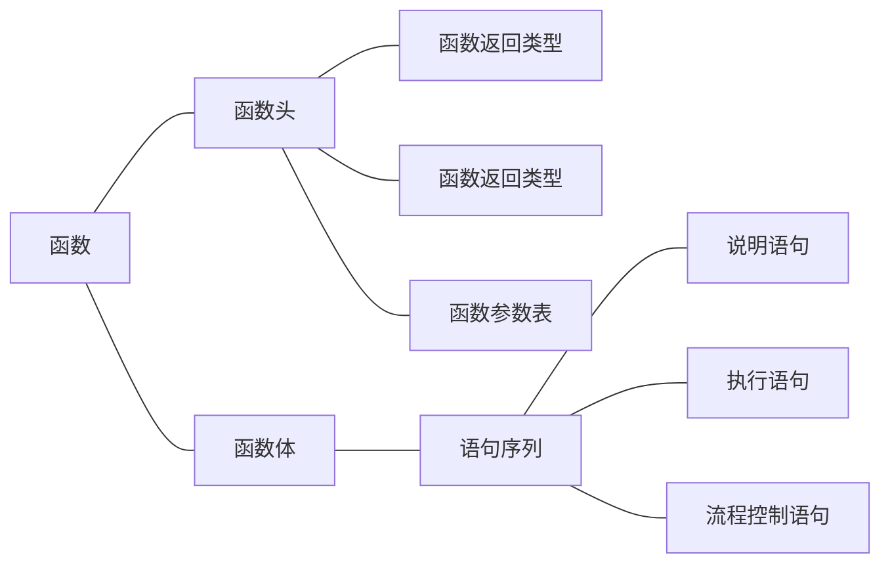
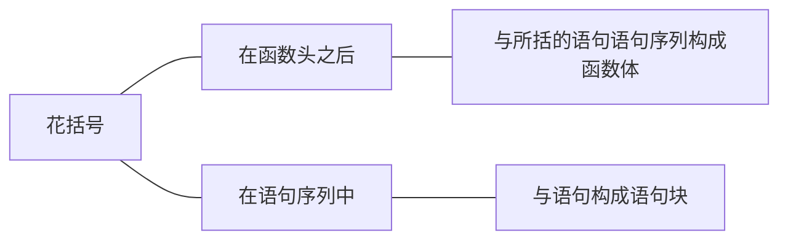
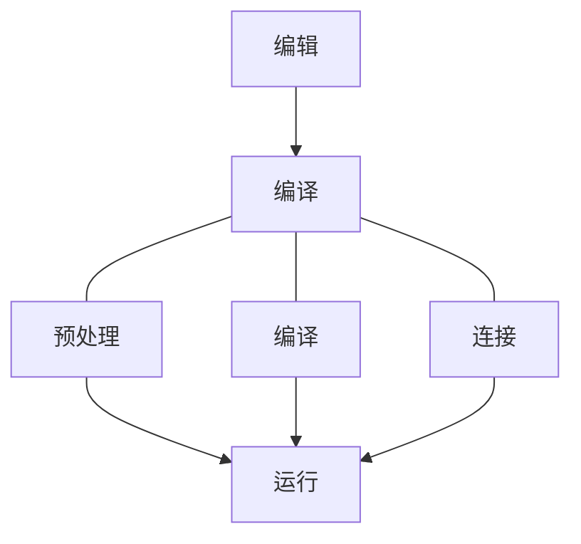
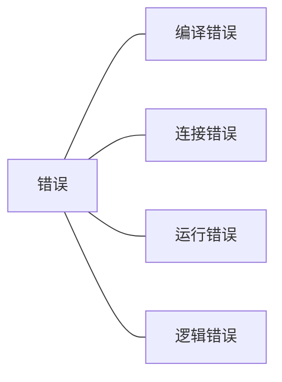
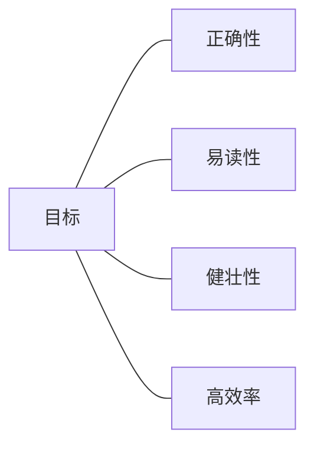

[toc]
#第1章 基本数据与表达式
##1.1 概述
[C++语言](../../../词库/C++语言.md)源于[C语言](../../../词库/C语言.md),C语言诞生于1970s,最初目的为编写[操作系统](../../../词库/操作系统.md).
C语言优点:
1. 具有高级语言的数据表示,运算功能
2. 可以直接对内存操作,运行效率高

C语言缺点:
1. 缺乏数据类型检查机制
2. 代码重用性差

1980s,美国贝尔实验室对C语言进行扩充改版,形成C++语言.
C++语言相对于C语言的优点有:
1. 强化了数据的类型检查和语句结构性
2. 增加了面向对象程序设计的支持

###1.1.1 程序设计与程序设计语言
[高级语言](../../../词库/高级语言.md)提供了常用的数据描述和对数据操作的规则描述,这些规则是"脱机"的,程序员只需要专注于问题的求解,不必关心机器内部结构和实现.用高级语言编写的程序称为源程序.计算机不能直接识别源程序,必须将源程序翻译成二进制代码才能在机器上运行.一旦[编译](../../../词库/编译.md)成功,目标程序可以反复高速执行.
程序设计主要完成以下两方面工作:
1. 数据描述
数据描述是指将被处理的信息描述成计算机可以接受的数据形式,如整数,实数,字符,数组等
2. 数据的处理
数据处理是指对数据进行输入,输出正丽,计算,存储,维护等一系列活动

###1.1.2 一个简单的C++程序
```C++
#include<iostream>
using namespace std;
类型 函数名 (参数表)
{
    语句序列
}
```
***
第一行是[预编译](../../../词库/预编译.md)指令,说明该程序要使用的外部文件.C++的标准[头文件](../../../词库/头文件.md)iostream包含了程序常用的输入和输出cin和cout的定义.
第二行是使用[名空间]的声明.
C++语言以函数为程序运行的基本单位.
函数名是标识符,用于识别和调用函数.每个程序必须有且只有一个[主函数](../../../词库/主函数.md),因为主函数是由系统启动的,main是系统规定的主函数名.
函数名之后,如果没有函数参数,圆括号也不能省略,它是C++函数的标识.函数名,函数返回类型,函数参数表组成C++的函数头.
函数头后花括号相括的构成函数体
花括号也可出现在语句序列中,此时花括号相括的语句成为复合语句或语句块.
以双斜杠开始的文本为程序注释,放在行末,以/*xxxx/*相括的注释文本可以放在程序的任何位置.
***

***


###1.1.3 程序的编译执行
实现一个C++语言源程序主要经过一下3个步骤:
1. 编辑
使用C++语言编辑器或其他文字编辑器录入源程序,保存为以.cpp为拓展名的文件
2. 编译
预处理>编译>连接
3. 运行
***

***
编写程序遇到的错误可分成以下四类

***
编写的程序应该达到以下目标

***
程序+文档=软件
##1.2 C++语言的字符集和词汇


