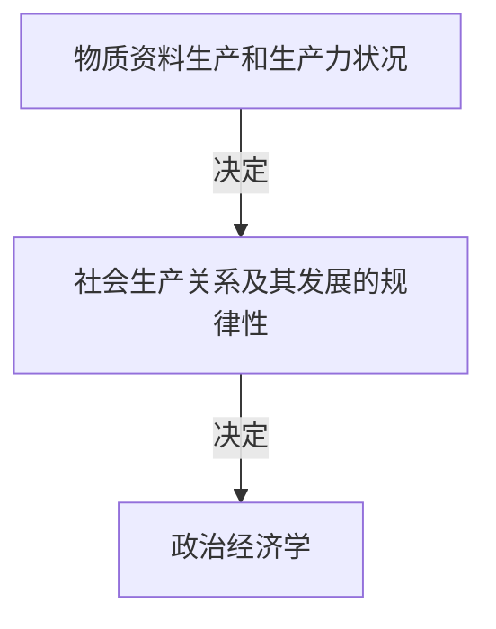
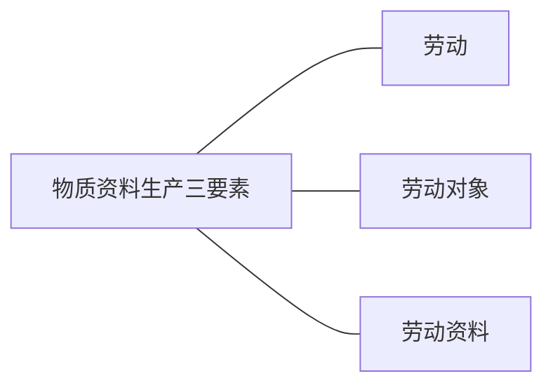
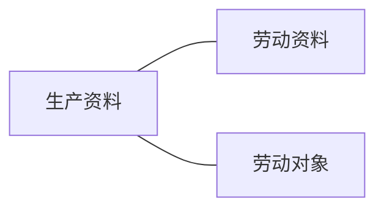
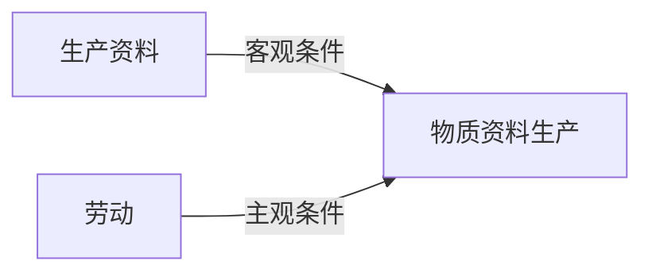
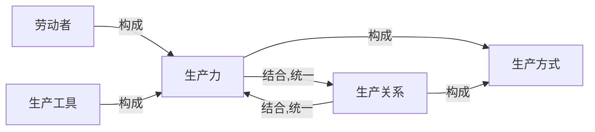
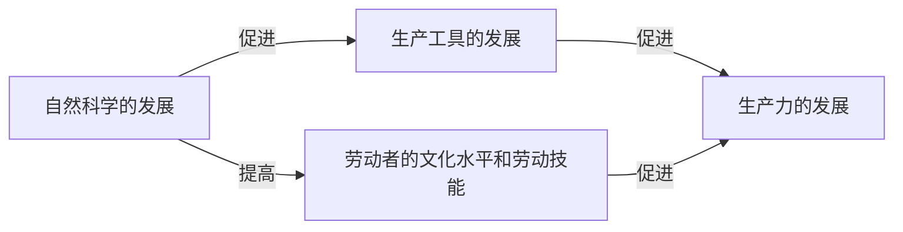

[toc]
# 1 政治经济学的研究对象
[政治经济学](../../../../词库/政治经济学.md)作为一门社会科学,他的研究对象是人类社会在一定社会生产力水平基础上形成的` 社会生产关系及其发展的规律性 `

## 1.1 物质资料的生产
### 1.1.1 物质资料生产是人类社会存在和发展的基础
[物质资料生产](../../../../词库/物质资料生产.md)包括三要素:
1. 劳动本身
[劳动](../../../../词库/劳动.md)就是具有一定生产经验和劳动技能的劳动者,使用劳动工具所进行的有目的的生产活动,它是生产的` 基本要素 `.

2. 劳动对象
[劳动对象](../../../../词库/劳动对象.md)即人们在生产过程中吧自己的`劳动`加于其上的一切东西.

3. 劳动资料
[劳动资料](../../../../词库/劳动资料.md)即人们用来把自己的`劳动`传导到`劳动对象`上去的一切物质资料.

马克思说过
>各种经济时代的区别,不在于生产什么,而在于怎么生产,用什么劳动资料生产.

[生产资料](../../../../词库/生产资料.md)是`劳动资料`和`劳动对象`的总称.

## 1.1.2 生产方式的两个方面

[生产方式](../../../../词库/生产方式.md)包括两方面:
1. 生产力
[生产力](../../../../词库/生产力.md)是具有一定生产经验和和劳动技能的`劳动者`运用`生产工具`加工`劳动对象`进行生产时形成的物质力量.`生产力`包括两个因素:
    1. 劳动者
    2. 生产工具
2. 生产关系
[生产关系](../../../../词库/生产关系.md)指人们从事生产活动时相互结成的一定的关系.

在人类社会历史上,相继出现过[原始社会](../../../../词库/原始社会.md),[奴隶社会](../../../../词库/奴隶社会.md),[封建社会](../../../../词库/封建社会.md),[资本主义社会](../../../../词库/资本主义社会.md)和[社会主义社会](../../../../词库/社会主义社会.md)
## 1.2 社会生产力
### 1.2.1 生产力的形成
[生产工具](../../../../词库/生产工具.md)是所有用于加工`劳动对象`的统称.
在不同`生产方式`条件下,`劳动者`与`劳动工具`结合的性质和方法也不同.`劳动者`只有和`劳动工具`以一定的性质和方式结合,并把`生产工具`运用起来后才能加工于`劳动对象`,从而形成实际的`生产力`.
### 1.2.2科学技术是第一生产力
邓小平不仅肯定了
>科学技术是生产力

而且进一步提出
>科学技术是第一生产力

## 1.3 社会生产关系
### 1.3.1 人们的生产、分配、交换和消费的关系
[生产关系](../../../../词库/生产关系.md)就是人们以某种`生产资料所有制`为基础,在`生产过程`中形成的`生产`,`分配`,`交换`和`消费`.
### 1.3.2 生产和消费的关系
`生产`,`消费`,`消费品`,`生产资料`
`消费品的消费`生产出`人的劳动力`
`消费品的生产`决定`消费`的`对象`和`方式`,即`生产`决定`消费`
`消费`推动`生产`发展:
1. 消费使生产出来的产品得以完成其为产品
2. 消费为生产创造动力

### 1.3.3 生产和分配的关系
分配有两种:
1. 产品的分配
在产品分配上,`生产`决定`分配`,表现为以什么方式参与生产,就以什么方式参与分配
2. 生产资料和社会成员在生产过程中的分配
在这种分配上,`分配`决定`生产`,如同马克思所言
>在分配时产品的分配之前,它是生产工具的分配,社会成员在各类生产之间的分配......这种分配包含在生产过程本身中,并且决定生产的结构,产品的分配显然只是这种分配的结果.

### 1.3.4 生产和交换的关系
交换有两种:
1. 生产性的交换,即`生产要素`的交换
包括人们劳动能力的交换,生产资料的交换
2. 生产品的交换

`产品交换`的深度和广度是由生产过程中的`分工发展`的深度和广度决定的,可见,`产品交换`是由`生产`决定的
`产品交换`发展反作用于`生产`

