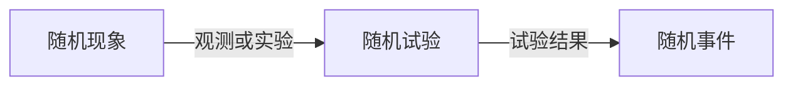
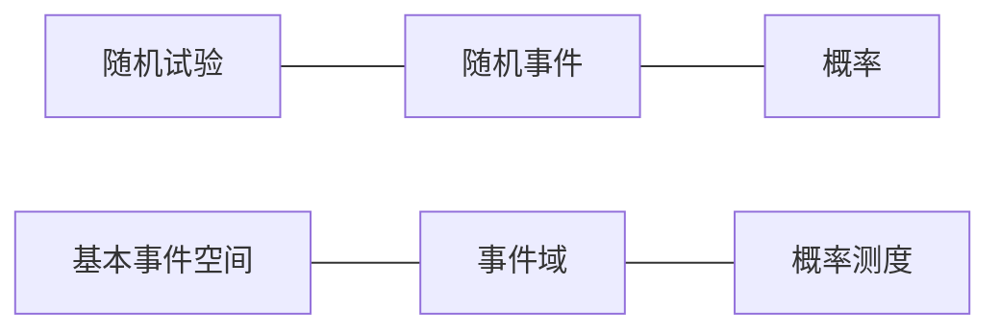

[toc]
# 1 随机事件与概率
## 1.1 随机现象和随机试验
### 1.1.1 随机试验与随机事件
[随机现象](../../../词库/随机现象.md):偶然性现象中在基本相同条件下可重复观测或实验的,并且随着观测或实验次数增多而结果呈现出统计规律的现象.
[随机试验](../../../词库/随机试验.md):为对`随机现象`的一次观测或实验,满足三个条件:
1. 可重复
2. 结果范围已知
3. 每次实验的结果不可预知

[随机事件](../../../词库/随机事件.md):为`随机试验`的结果
### 1.1.2 事件关系与运算
[必然事件](../../../词库/随机必然事件.md):观测随机现象是某结果每次都出现
[不可能事件](../../../词库/不可能.md):某个结果每次都不出现
#### 事件的关系
1. 相等
A发生同时B也发生,反之亦然.即A与B相等.
2. 包含
A发生同时B也发生,即B包含于A.
3. 对立
A发生的同时B必然不发生且A不发生B必然发生.即A与B对立.
4. 互斥
A发生的同时B不发生,即A与B互斥

#### 事件的运算
1. 事件的积(或交)
一次试验中A和B同时发生的`结果`
2. 事件的和(或并)
一次试验中A或B至少有一个发生的`结果`
3. 事件的差
A出现且B不出现的结果称为A与B的差

#### 事件运算的法则
对于积与和运算,有
1. 结合律
2. 交换律
3. 分配律

对于积,和与对立运算,有
1. 对偶律
$$\overset{-----}{A∪B}=\overset{-}{A}∩\overset{-}{B}$$

## 1.2 概率的定义
[概率](../../../词库/概率.md)
### 1.2.1 概率的统计定义
随着观测次数n的增加,某一事件A发生的频率会在0-1的一个数p附近摆动,我们称p为A发生的概率.
### 1.2.2 概率的古典定义
设随机试验只有n个结果,每次实验有且只有1个发生,且每个结果发生可能性大小相同,则定义事件A发生的概率为
$$P(A)=\cfrac{n_A}{n}$$
$n_A$为事件A中包含的元素个数
称这种计算概率的数学模型为`古典概型`.
### 1.2.3 概率的几何定义
设随机试验是往区域Ω里投点,点落到某子区域G的可能性大小只与G的度量大小有关而和G的形状和位置无关,则
$$P(点落到子区域G)=\cfrac{|G|}{|Ω|}$$
|.|表示几何度量
称这种计算概率的模型为`几何概型`
### 1.2.4 概率的公理化定义

1. [基本事件空间](../../../词库/基本事件空间.md)(Ω)
设Ω为一些事件构成的集合,如果每次试验有且仅有Ω中的一个事件发生,则称Ω为`基本事件空间`(或`样本空间`),称Ω中的事件为`基本事件`(或`样本点`)
2. [事件域](../../../词库/基本事件空间.md)($\digamma$)
设Ω为基本事件空间,$\digamma$为Ω的一些子集构成的`集合`,若满足以下
    1. Ω∈$\digamma$
    2. 若A∈$\digamma$,则$\overset{-}{A}$属于$\digamma$
    3. 若$A_n$∈$\digamma$,n=1,2...,则$A_1$,$A_2$....$A_n$的并集∈$\digamma$

3. [概率测度](../../../词库/概率测度.md)($\Rho$) 
事件的一种`度量`,一个事件在该度量下的大小代表该事件发生的可能性大小
若满足
    1. 非负性 对任一事件A∈$\Rho$,都有$\Rho$(A)≥0
    2. 规范性 $\Rho$(Ω)=1
    3. 可列可加性 事件和的概率=事件概率的和

    则$\Rho$为事件域$\digamma$上的概率测度,而称$\Rho$(A)为事件A的概率
    `概率测度的性质`
        1. 
        2.
        3.
        4.
        5,
        6.
        

